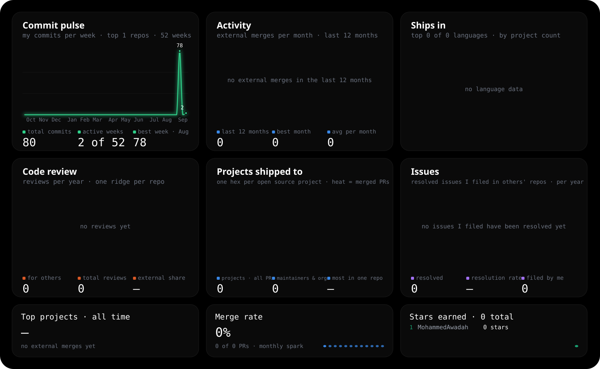
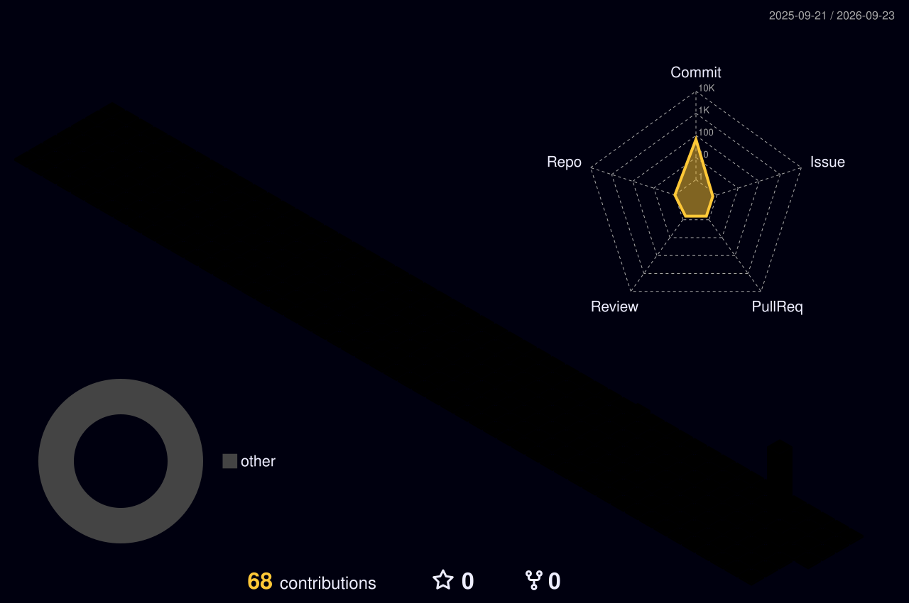

<h1 align="center">👋 Hello, I'm Mohammed Awadah</h1>

<!--

  

-->

## 👨‍💻 About Me

🎓 Computer Science Student passionate about Software Engineering & Computer Science.

🧠 Building Strong Foundations In:
- C++
- Object-Oriented Programming
- Data Structures
- Algorithms & Problem Solving
- Software Engineering Principles

🚀 Currently Expanding Into:
- C#
- .NET Development
- Windows Forms
- SQL Server
- ADO.NET
- Git & GitHub
- Docker

# 🛠 Skills & Tools

  

 

 

# 🔥 GitHub Streak

  

# 📈 Activity Graph

# 📊 GitHub Metrics Dashboard

<!-- # ⭐ Featured Projects -->

<h1>CONTRIBUTIONS</h1>

<!--
&nbsp;

-->

<!-- ==================== CONTACT ==================== -->

<h2>📬 Contact Me</h2>

I'm always open to connecting with developers, discussing software engineering,
and exploring new opportunities.

 
&nbsp;
  

   
  
💻 Software Engineering &nbsp; • &nbsp;
🤖 Artificial Intelligence &nbsp; • &nbsp;
🚀 Building & Learning
 
 
 ⚡Continuous Learning
  

 

